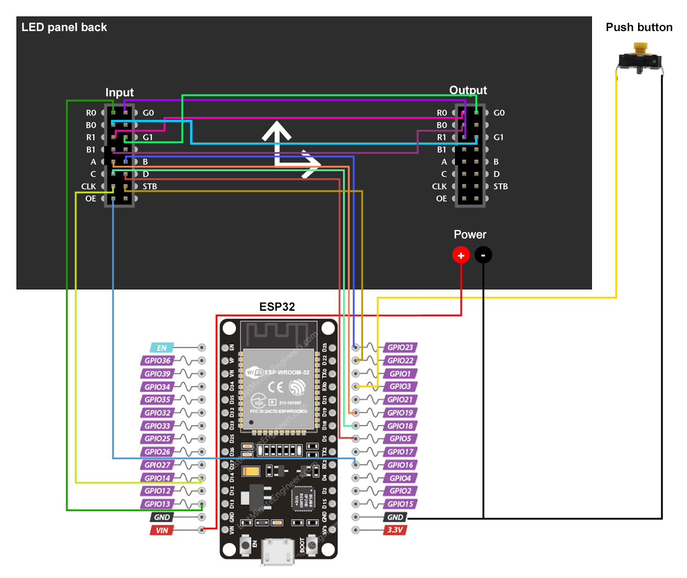
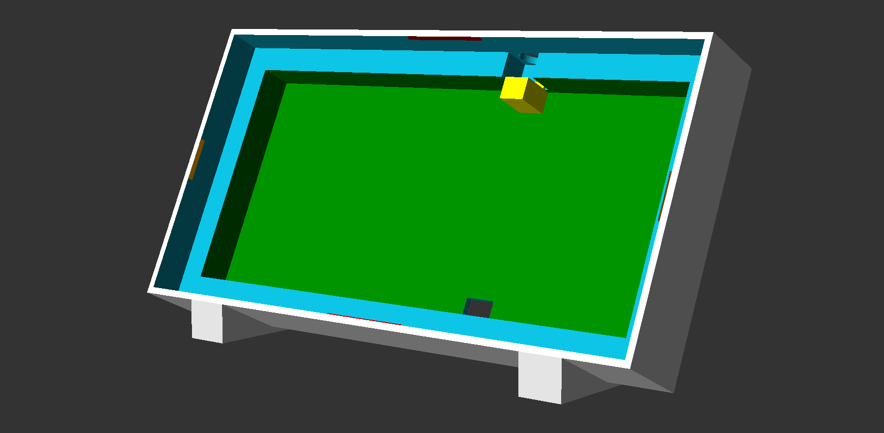

# ⏰ esp-led-timer

> 64x32 led matrix timer for conferences, based on ESP8266/ESP32.

<!-- TODO: YT unlisted demo video -->

## Components used
- 64x32 P4 LED Panel [aliexpress](https://aliexpress.com/item/1005004050044228.html)
- ESP32 CH340 Type-C [aliexpress, make sure to pick the right one](https://aliexpress.com/item/1005004616357165.html)
- 2m USB-C cable [aliexpress, make sure to pick the right one](https://aliexpress.com/item/1005004215823904.html)
- 20W USB-C Charger [aliexpress](https://aliexpress.com/item/1005001875465341.html)
- 10cm M-F Dupont Cable 40pin [aliexpress, make sure to pick the right one](https://aliexpress.com/item/1005004073424751.html)
- 10cm M-M Dupont Cable 40pin [aliexpress, make sure to pick the right one](https://aliexpress.com/item/1005004073424751.html)
- 20cm M-M Dupont Cable 40pin [aliexpress, make sure to pick the right one](https://aliexpress.com/item/1005004073424751.html)
- Push button kit [aliexpress](https://aliexpress.com/item/1005005012663073.html)

**Total:** about 30 euros

## Wiring diagram

Connect panel input (PI) and and panel output (PO) like this:

PI | PO
---|---
R1 | R0
G0 | R1
G1 | G0
B0 | G1
B1 | B0

Connect panel input (PI) to the ESP8266 or ESP32 like this:

PI      | ESP8266 GPIO | ESP32 GPIO
--------|--------------|------------
A       |  05 - (D1)   | 19 
B       |  04 - (D2)   | 23 
C       |  15 - (D8)   | 18 
D       |  12 - (D6)   | 5 
STB/LAT |  16 - (D0)   | 22 
P_OE    |  02 - (D4)   | 16 
CLK     |  14 - (D5)   | 14 
R0      |  13 - (D7)   | 13 

Connect push button pins to the ESP8266 or ESP32 like this:

BUTTON | ESP8266 GPIO | ESP32 GPIO
-------|--------------|------------
L      | RX - (D9)    | 3
R      | GND          | GND

## 3D printed case

You'll find a parameterized case model in `case/case.scad`.

You can customize and compile this file into an STL using [OpenSCAD](https://openscad.org).

I recommend to set `test_print` to true in the customizer ("Other" tab) and first print these test models to test and adapt the `tolerance` value for your printer (higher = more loose fit, smaller = tighter fit).

This model makes use of the BOSL2 library, see [instructions here](https://github.com/revarbat/BOSL2) for how to install it.

## Building project

This project is built using [VS Code](https://code.visualstudio.com/) and [PlatformIO](https://platformio.org/).

Once loaded, Platform IO will download the platform SDK and dependencies automatically, then you'll be able to build and upload the project to your ESP.

> You update the `platformio.ini` file to change the board type and platform, this project is compatible with both ESP8266 and ESP32 boards.

## How to use

### 1-button interface

- **Push button:** start/stop timer
- **Long press (1s)**: reset timer
- **Double press**: next mode
- **Triple press**: change brightness

Modes cycles between the logo/screensaver and the differents timers.

When the timer is not running, the logo/screensaver will be automatically activated after 5 minutes without touching any button.

## Updating bitmaps

To generate the bitmap arrays for images, I used [image2cpp](https://javl.github.io/image2cpp/).
Make sure to set RGB565 format and change the type to `uint16_t static` instead of `const uint16_t`, otherwise the app will crash.

The bitmaps are located in `src/bitmaps.h`.

For drawing the bitmaps I used [PixiArt](https://www.pixilart.com/draw).
