# Assembly guide

This is a step-by-step guide to assemble the project.
After following these steps, you will have a fully working device looking like this:


## Parts and tools needed

Not counting the tools and 3D printed parts, this project costs about 30 euros in parts.

- 1x 64x32 P4 LED Panel [aliexpress](https://aliexpress.com/item/1005004050044228.html)
- 1x ESP32 CH340 Type-C [aliexpress, make sure to pick the right one](https://aliexpress.com/item/1005004616357165.html)
- 1x 2m USB-C cable [aliexpress, make sure to pick the right one](https://aliexpress.com/item/1005004215823904.html)
- 1x 20W USB-C Charger [aliexpress](https://aliexpress.com/item/1005001875465341.html)
- 5x 20cm F-F Dupont Cable 40pin [aliexpress, make sure to pick the right one](https://aliexpress.com/item/1005004073424751.html)
- 8x 10cm F-F Dupont Cable 40pin [aliexpress, make sure to pick the right one](https://aliexpress.com/item/1005004073424751.html)
- 4x 10cm M-F Dupont Cable 40pin [aliexpress, make sure to pick the right one](https://aliexpress.com/item/1005004073424751.html)
- 1x Push button kit [aliexpress](https://aliexpress.com/item/1005005012663073.html)
- 4x screws TODO
- Soldering iron
- Soldering tin
- Electrical tape
- Double sided tape
- Screwdriver

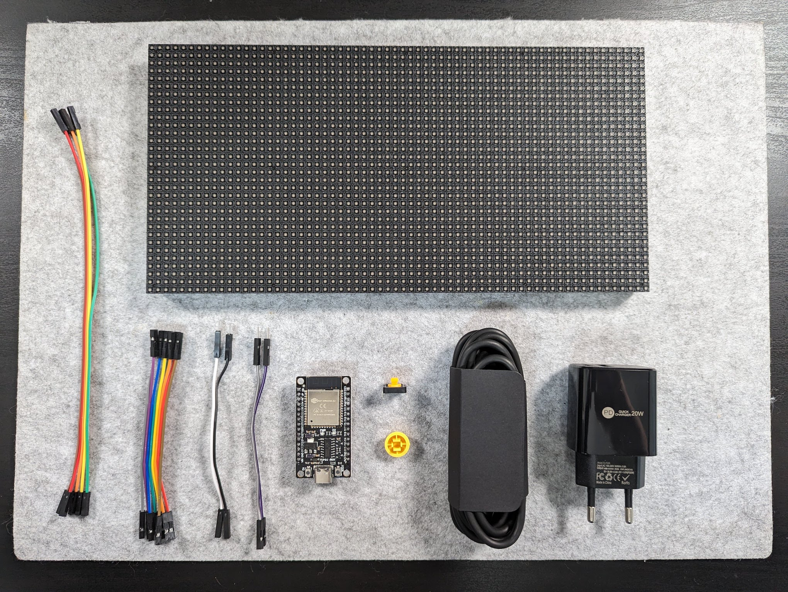

You'll also need to print [the case](../case/) using a 3D printer. If you don't have a 3D printer, you can ask a friend who have one or find a fab lab near your home.

## Soldering the panel power

We'll start by soldering the panel power wires to 10cm M-F Dupont Cables.
Pick 2 10cm M-F Dupont Cables and bend the pins like this:


Pick the LED panel, and make sure to position it with the arrows pointing up:

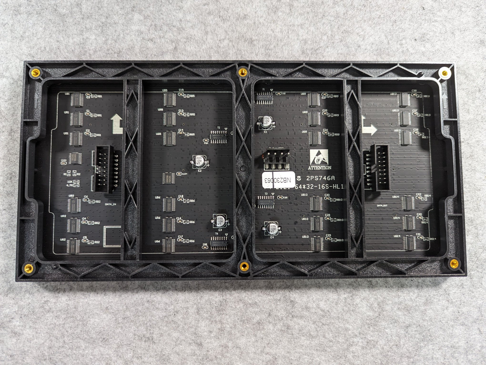

Then, solder the cables to the panel power wires. The negative wire is the one on the right, and the positive wire is the one on the left:

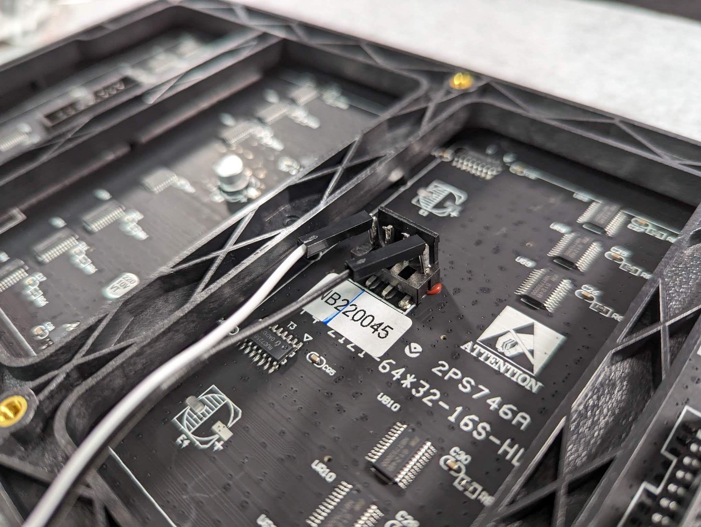

## Soldering the button switch

Next we'll solder the button switch to the 10cm M-F Dupont Cables.
Pick 2 10cm M-F Dupont Cables and solder it to the button switch pins on a same side (left or right, it doesn't matter):

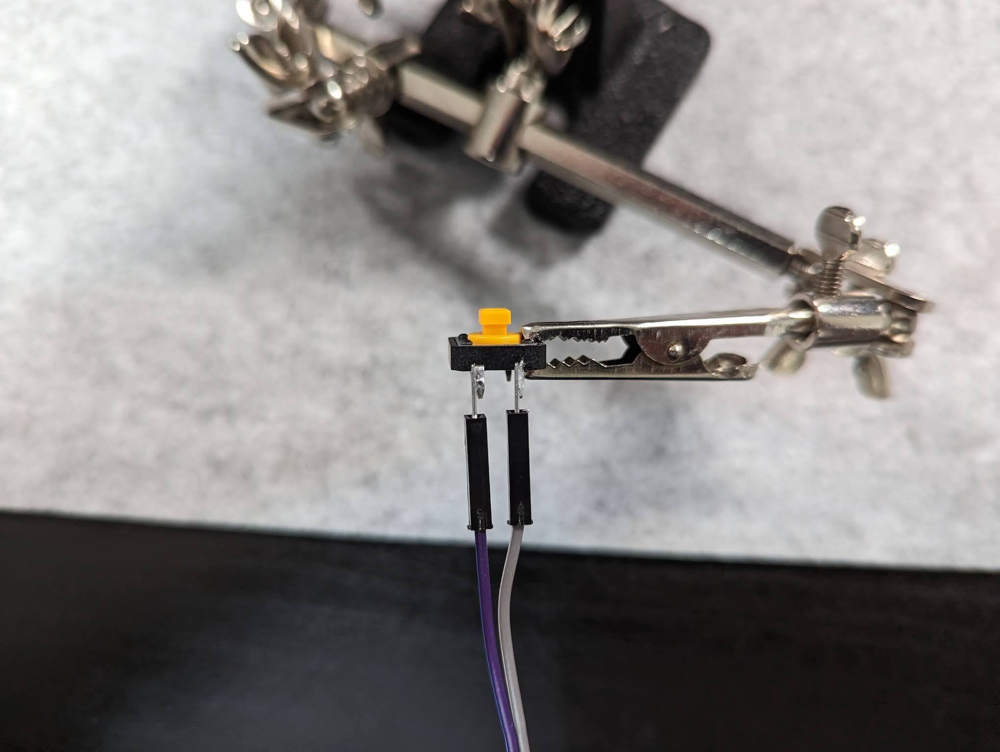

Position the cable pin and the button pin so that they are aligned side by side, to avoid making a bulge as it would make it harder to fit in the case later.

(And try to do a better job than me at soldering 😆)

## Wiring the panel

Here is the complete wiring diagram:


We'll first wire the panel inputs (PI) and outputs (PO) together using the 20cm F-F Dupont cables.
Connect panel input (PI) and and panel output (PO) following this table:

PI | PO
---|---
R1 | R0
G0 | R1
G1 | G0
B0 | G1
B1 | B0

The result should look like this:

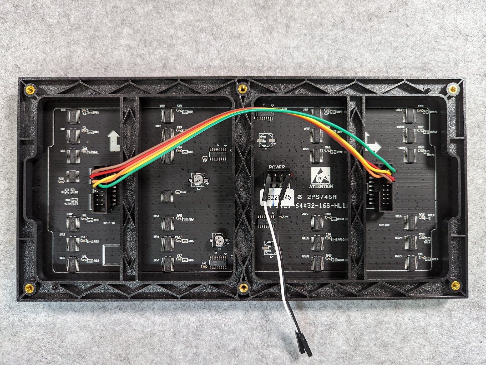

## Wiring the ESP32

Pick the 10cm F-F Dupont Cables and connect the ESP32 to the panel following this table:

PI      | ESP32 GPIO
--------|-------------
A       | 19 
B       | 23 
C       | 18 
D       | 5 
STB/LAT | 22 
P_OE    | 16 
CLK     | 14 
R0      | 13 

It's easier to first all the cables to the panel, then to the ESP32. After you're done, connect the button switch to the ESP32:

BUTTON | ESP32 GPIO
-------|-------------
Pin 1  | RX0
Pin 2  | GND

You should end up with something like this:

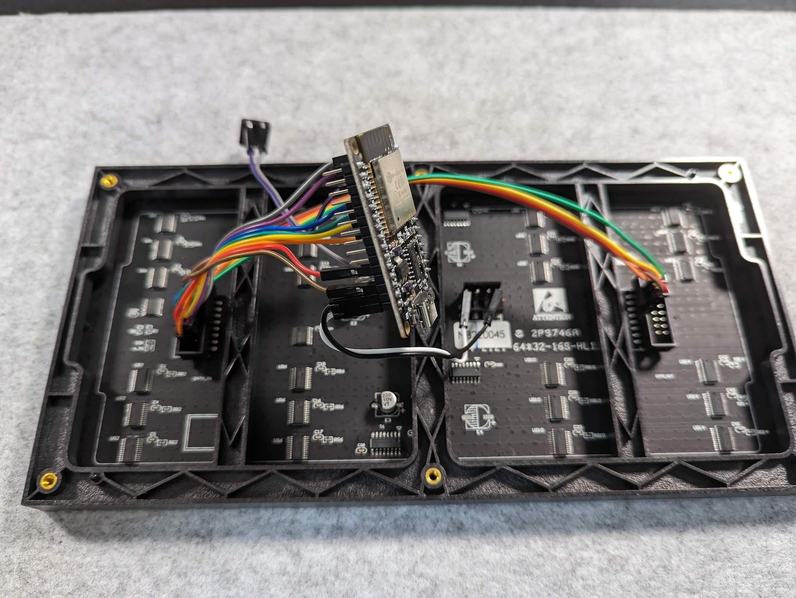

## Uploading the firmware and testing

At this point it is a good idea to test the wiring before going further. To do so, you'll need to upload the firmware to the ESP32.

The easiest it to install [VS Code](https://code.visualstudio.com/) and the [PlatformIO](https://platformio.org/) extension. Follow the [installation guide](https://platformio.org/install/ide?install=vscode) to install both.

Open VS Code and select `Clone Repository`:


Enter the repository URL `https://github.com/sinedied/esp-led-timer` and select a folder to clone it to. After cloning, select `Open` when prompted.

PlatformIO will take some time to initialize the project and install the dependencies. Once it's done, connect the ESP32 to your computer using the USB-C cable and select the `Upload` button in the status bar:


The firmware will first compile, then upload to the ESP32. If everything goes well, you should see the following message in the terminal:

```
TODO
```

If your wiring is correct, the LED panel will light up and display the visual manual. Push the button to switch to the timer mode and check that the timer is working.

## Fixing the ESP32 to the case

Now that we know everything is working, we can complete the assembly.

Add some electrical tape on the panel in the top left corner of the section where the ESP32 will be placed, to avoid short circuits:

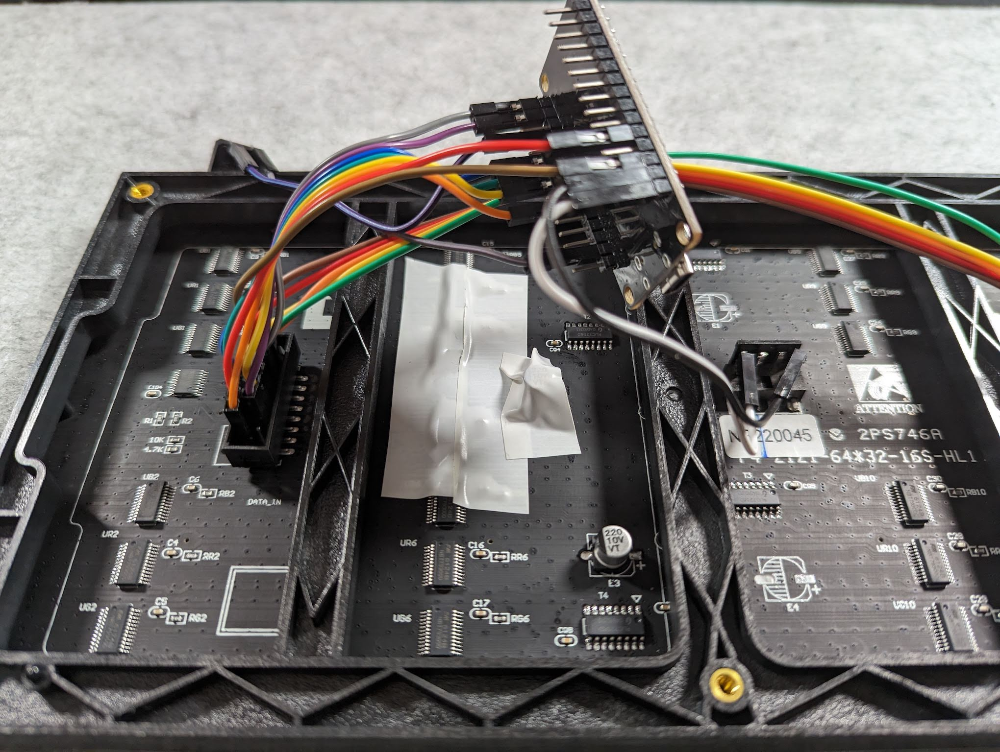

Then, add some double sided tape on the ESP32 processor and fix it to the case over the electrical tape we just added:

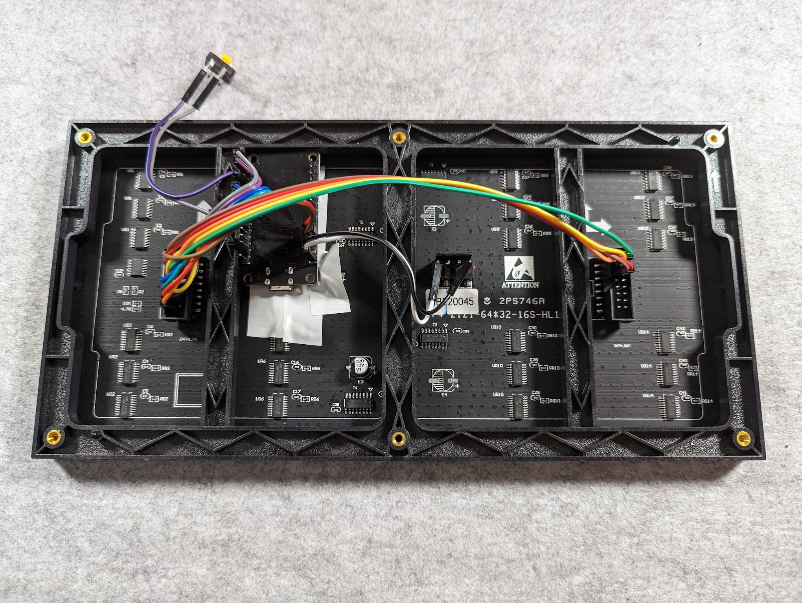

Flatten the cables a bit to make it easier to fit in the case.

## 3D Printing the case

The next step is to 3D print the case. You can find the STL files and instructions for printing the case [here](../case/readme.md).

If you printed the case in 2 separate parts, you'll need to assemble the left and right parts together. Don't force too much or you'll break the plastic. If it doesn't fit, try to sand the parts a bit. The fit should be tight so the parts doesn't move, but must fit with only a bit of force.

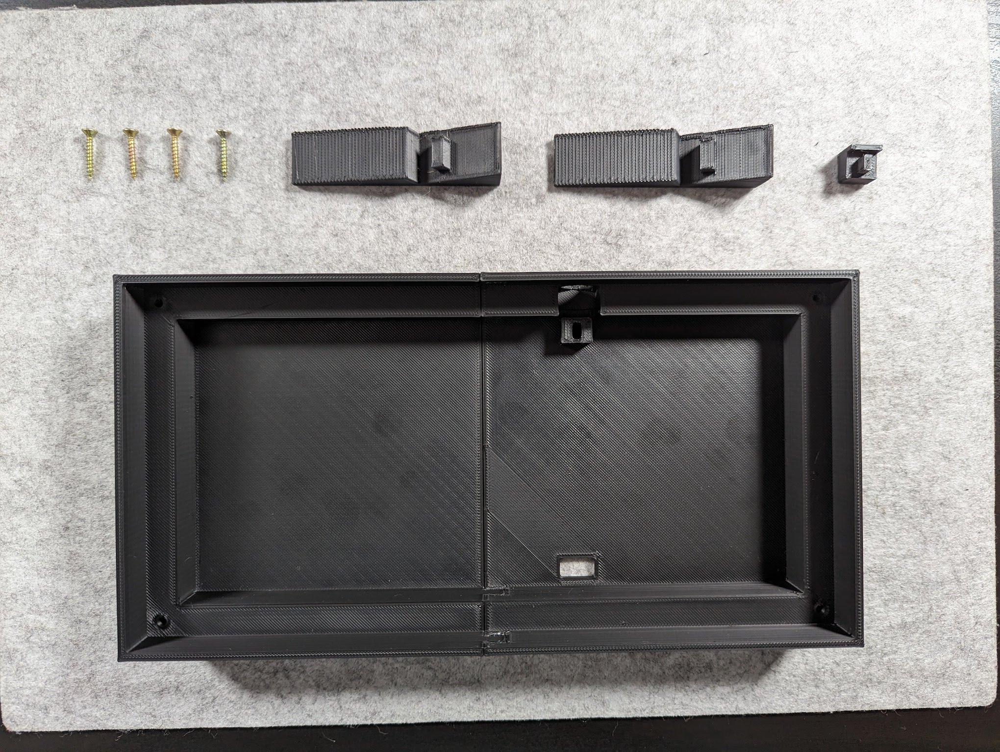

## Assembling the case

It's time to assemble the case and the electronics.

1. Pass the cables through the hole in the case, from the outside to the inside, and position the button cap from the inside:

   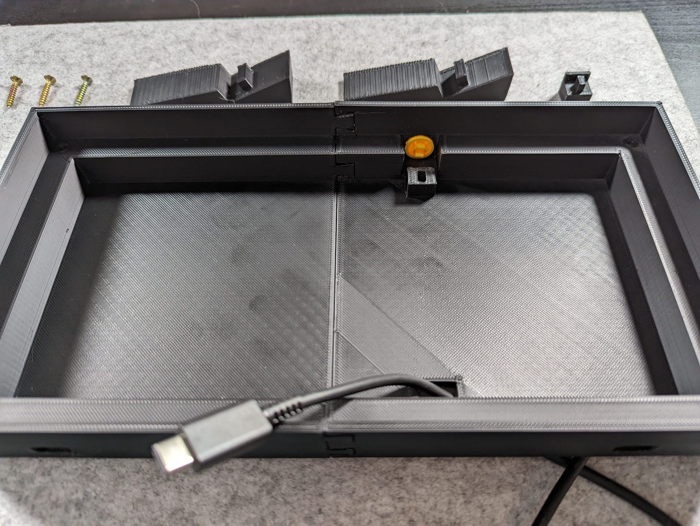

  The button cap should be sliding without difficulty. If it doesn't, remove it and try to sand the hole a bit.

2. Plug the USB-C cable to the ESP32 without leaving too much cable inside the case.

3. Place the button switch inside the button cap, with the 2 connected pins on the left side of the support:

   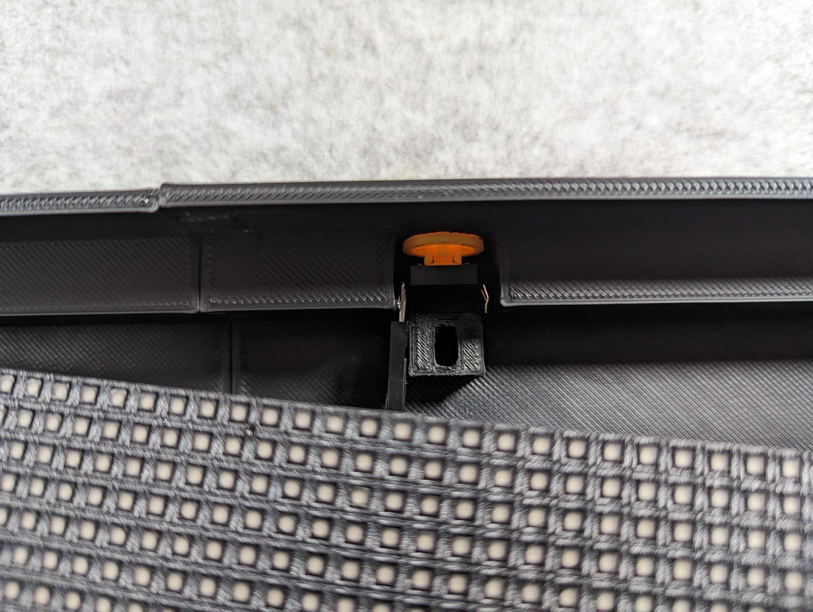

4. Insert the 3D printed button holder with the tab sliding just under the button switch:

   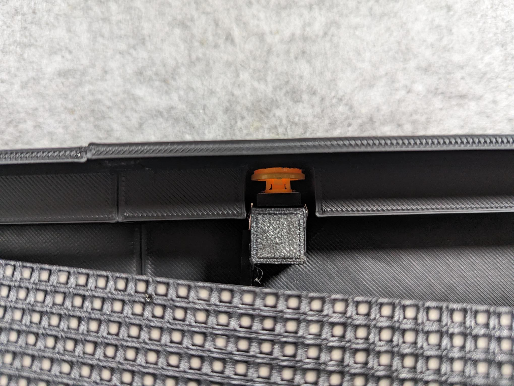

   Make sure the button switch works fine and doesn't get stuck.

5. Place the LED panel in the case, while making sure no cables are pinched. Hold the case and panel together to return it and access the screw holes on the back. Screw the panel to the case using the 4 screws.

6. Insert the removable support feet in the bottom of the case.

You're done! 🎉

